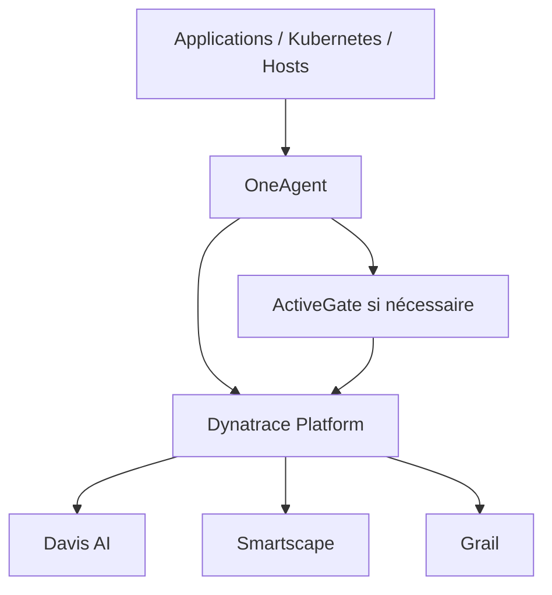
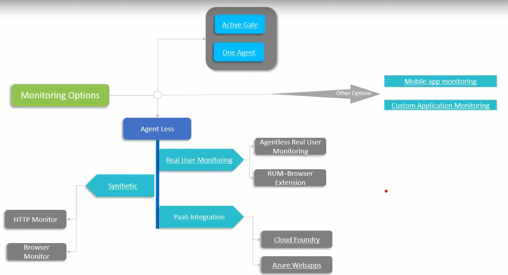

# Note Dyna

Référentiel Git de notes Dynatrace, structuré en Markdown.

## Sommaire

1. [Fondamentaux Dynatrace](docs/01-fondamentaux.md)
2. [Monitoring et observabilité](docs/02-monitoring-observabilite.md)
3. [Modes de déploiement](docs/03-modes-de-deploiement.md)
4. [Kubernetes](docs/04-kubernetes.md)
5. [Expérience utilisateur](docs/05-experience-utilisateur.md)
6. [Gouvernance, sécurité et SLO](docs/06-gouvernance-securite-slo.md)
7. [Résilience : RPO, RTO et failover](docs/07-resilience.md)
8. [Questions et pièges fréquents](docs/08-questions-pieges.md)
9. [Glossaire](docs/09-glossaire.md)
10. [Corrections et points de vigilance](docs/10-corrections.md)
11. [Schéma original — Monitoring Options](docs/architecture/monitoring-options.md)

## Architecture simplifiée



> ActiveGate n’est pas obligatoirement placé entre OneAgent et Dynatrace.  
> OneAgent peut communiquer directement avec la plateforme lorsque le réseau le permet.

## Schéma fourni



## Initialisation Git

```bash
git init
git add .
git commit -m "Initialisation Note Dyna"
```
