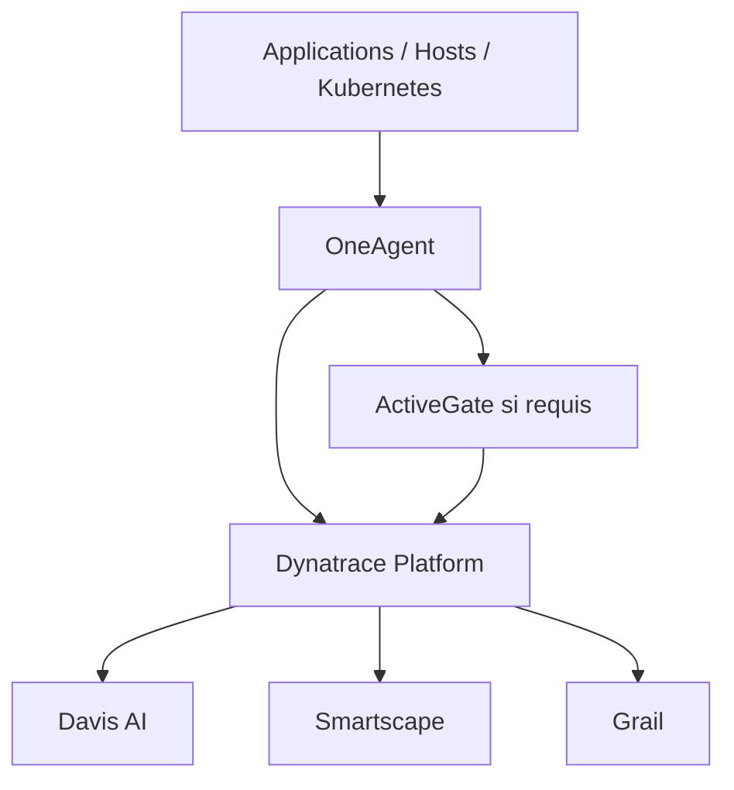

# 1. Fondamentaux Dynatrace

## Composants principaux

| Composant | À retenir |
|---|---|
| **OneAgent** | Collecte les métriques, processus, services, traces et, selon la configuration, les logs. |
| **ActiveGate** | Assure le routage, certaines intégrations cloud, les extensions, le Synthetic privé et certains flux sécurisés. |
| **Davis AI** | Détecte les anomalies, corrèle les événements et aide à identifier la cause racine. |
| **Smartscape** | Cartographie automatiquement les entités et leurs dépendances. |
| **Dynatrace Operator** | Automatise le déploiement et la gestion de Dynatrace dans Kubernetes. |
| **Dynatrace API** | Permet l’automatisation et la configuration via API REST. |
| **Service Flow** | Visualise les communications et dépendances entre services. |
| **Grail** | Plateforme de données unifiée et contextuelle pour métriques, logs, traces, événements et données métier. |
| **Continuous Delivery Insights** | Analyse l’impact des changements de code et des déploiements sur la performance et la qualité. |
| **Guardian** | Évalue automatiquement des objectifs de qualité et peut être intégré à des workflows de remédiation. |

## Architecture générale

## Dynatrace SaaS vs Dynatrace Managed

| Sujet | Dynatrace SaaS | Dynatrace Managed |
|---|---|---|
| Hébergement | Plateforme hébergée par Dynatrace | Plateforme hébergée par le client |
| Maintenance | Gérée par Dynatrace | Gérée par le client |
| Mises à jour | Gérée par Dynatrace | Planifiées et opérées par le client |
| Stockage | Géré par Dynatrace | Géré par le client |
| Haute disponibilité | Gérée par Dynatrace | À concevoir et maintenir par le client |
| Cas d’usage | Service cloud managé | Contraintes réglementaires, sécurité, réseau isolé |

## Points à connaître absolument

- OneAgent
- ActiveGate
- Davis AI
- Smartscape
- Problems et Events
- Kubernetes Monitoring
- Distributed Tracing
- Tags et Management Zones
- SLO et SLI
- Dashboards
- RUM vs Synthetic
