# 11. Pratique hands-on : Distributed Tracing, Multidimensional Analysis, RUM

> Exercices réalisés sur le playground Dynatrace, en complément des chapitres théoriques (voir chapitre 2 pour les définitions de Distributed Tracing/PurePath et chapitre 5 pour RUM/Synthetic).

## 11.1 Distributed Tracing — diagnostiquer une lenteur sans service connu

Méthode top-down : symptôme global → service coupable → root cause dans le PurePath.

### Étape 1 — Repérer un pic sur la vue globale

Dans `Distributed Tracing → Explorer → Requests → Timeseries`, sans filtre, sur un timeframe large (24h/7j) :

- Barres grises = volume de requêtes
- Courbes = 50th percentile, 90th percentile, Average (durée)
- Un pic net sur le **90th percentile** signale une latence élevée touchant une sous-partie du trafic — plus révélateur que la moyenne, qui est lissée par le volume de requêtes rapides.

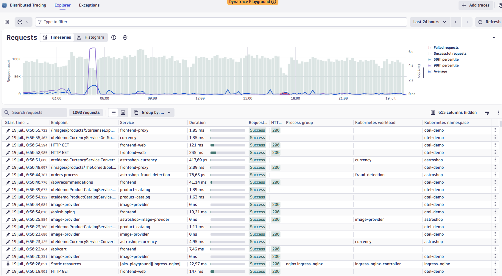

### Étape 2 — Isoler la période du pic

Clic-glisse sur le graphique pour zoomer progressivement (grand zoom → zoom fin) jusqu'à isoler le plateau du pic.

⚠️ Après un zoom, la table de requêtes ne se filtre pas automatiquement — vérifier que le timeframe global (en haut à droite) est bien mis à jour.

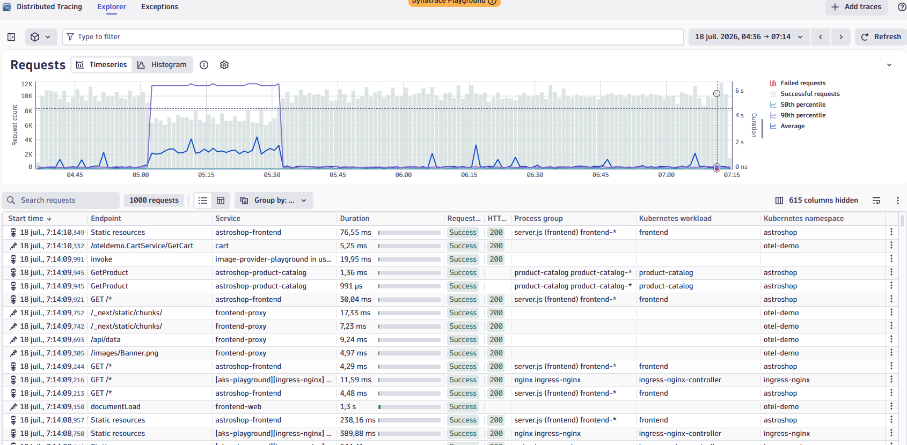
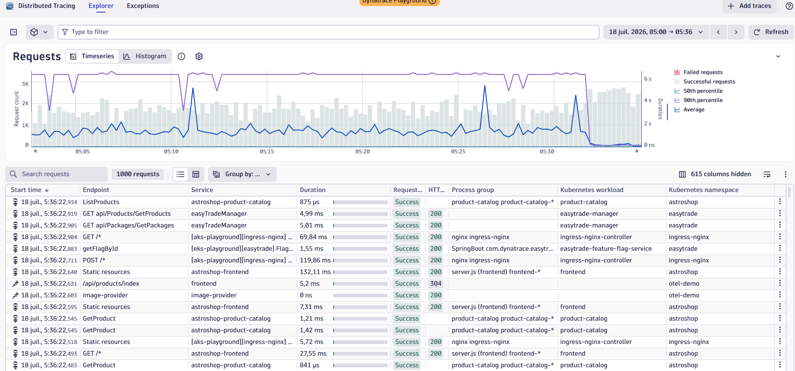

### Étape 3 — Trier/grouper pour identifier le service coupable

Tri de la table par colonne **Duration** décroissante.

⚠️ Piège : certains endpoints ont une durée naturellement longue sans être un incident (ex. connexions streaming/gRPC de type feature-flag evaluation, ~10 min, normal). Le vrai signal : `Request status = Failure` + codes **5xx** + durée anormale, croisés ensemble — jamais un seul critère isolé.

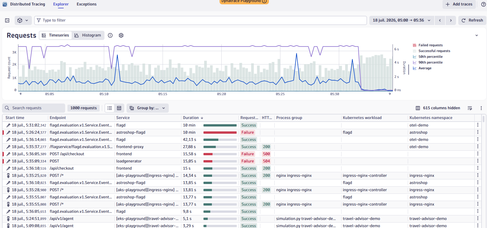

### Étape 4 — Ouvrir le PurePath et suivre la cascade waterfall

Clic sur la requête en échec → vue détail avec arbre des spans (gauche) et waterfall temporel (droite). Descendre jusqu'au span le plus profond marqué en erreur : un span parent peut afficher un statut « propre » (200) alors qu'un enfant plus profond échoue — la root cause est presque toujours dans les feuilles de l'arbre.

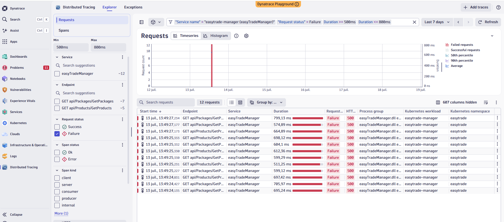

### Étape 5 — Identifier le span en erreur / la root cause

Panneau de droite (span sélectionné) + onglet **Exceptions** en bas de l'écran.

Deux root causes rencontrées en exercice :

| Cas | Root cause | Type |
|---|---|---|
| `easyTradeManager` / GetPackages, 500 | `SqlException` — error 40, could not open connection to SQL Server | Infra / connectivité DB |
| `/api/checkout`, 500/504 | `PaymentService Fail Feature Flag Enabled` | Applicatif / feature flag (panne simulée) |

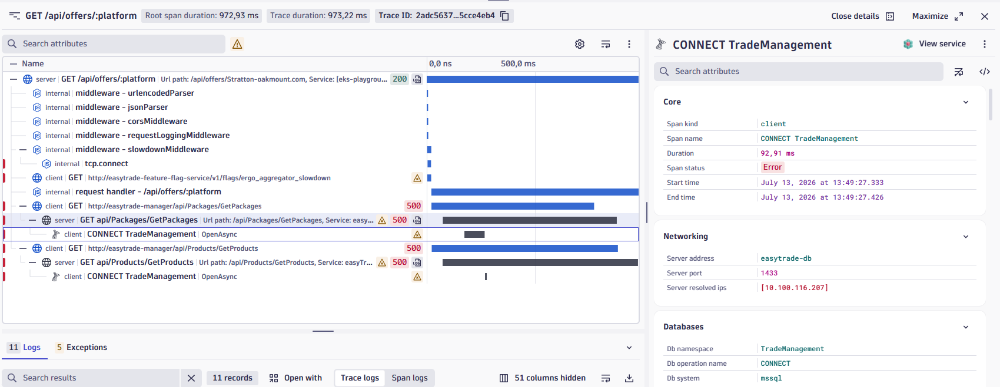
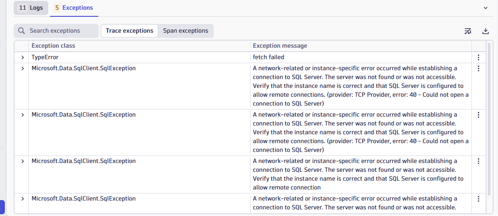

**Point clé propagation d'exception** : une même erreur d'origine remonte la chaîne d'appels et chaque span/couche qui l'intercepte l'enrobe avec son propre contexte avant de la relayer. Plusieurs exceptions visibles sur une trace ne sont donc souvent qu'un seul incident, décrit à différents niveaux — toujours remonter au message le plus profond/le plus court pour la vraie root cause.

## 11.2 Multidimensional Analysis (MDA)

> Analyse des **agrégats** sur tout le volume de traces (équivalent d'un `GROUP BY` massif), pour repérer et prioriser avant de creuser une trace individuelle dans Distributed Tracing. Dynatrace pousse à remplacer MDA par Notebooks/Distributed Tracing (nouvelle app), mais reste au programme Associate.

### Point d'entrée

3 requêtes « built-in » : **Top web requests**, **Top database statements**, **Exception analysis**, plus des « Custom analysis views » sauvegardées.

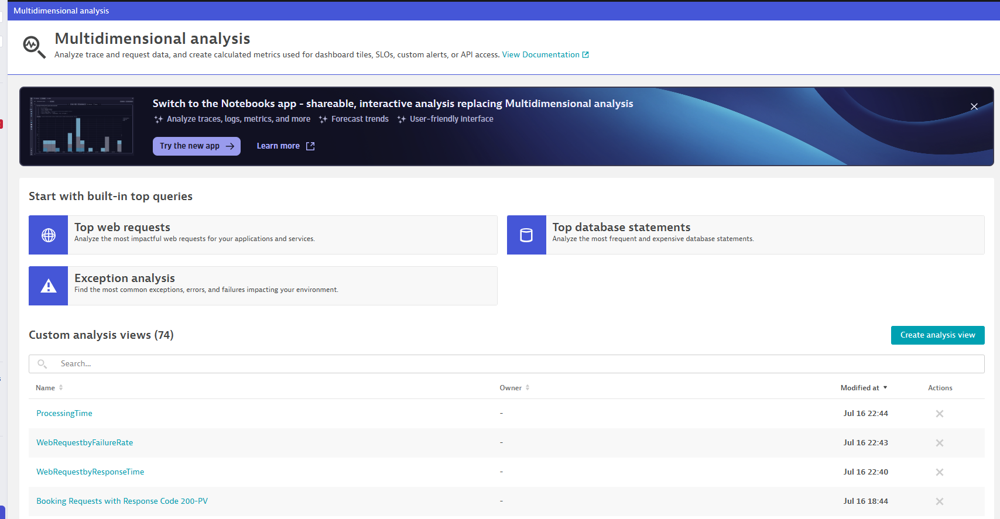

### Configurer la vue

| Champ | Rôle |
|---|---|
| **Metric** | Métrique agrégée (ex. `Exception count`, `Response time`) |
| **Aggregation** | `Sum`, `Avg`, `Count`, percentile... |
| **Split mode** | `Merge services` ou split par service |
| **Split by dimension** | Dimension de regroupement façon `GROUP BY` (ex. `{Exception:Class}`) |
| **Filter requests** | Filtre appliqué en amont |

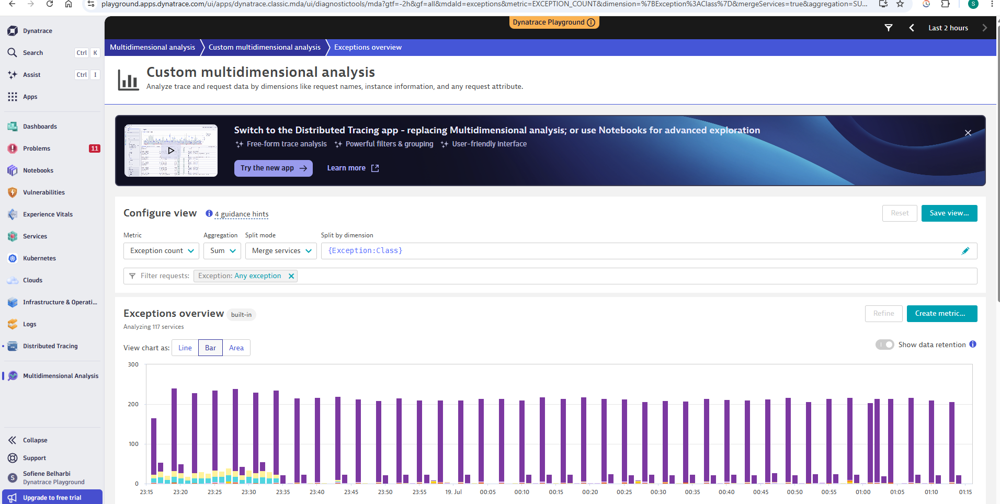

### Lire le tableau « Top dimensions »

⚠️ `Request count` ≠ `Metric count` : une seule requête peut générer plusieurs occurrences de la métrique (ratio à surveiller, pas le count brut isolé).

| Exception:Class | Request count | Exception count |
|---|---|---|
| PHP Deprecated | 4.56k | 9.11k |
| error | 182 | 305 |
| org.dynatrace.profileservice.exceptions.BioNotFoundException | 41 | 123 |
| org.springframework.web.server.ResponseStatusException | 4 | 12 |

Ne pas confondre un simple warning technique (`PHP Deprecated`, dette technique) avec une vraie exception applicative actionnable (`BioNotFoundException`, `ResponseStatusException`).

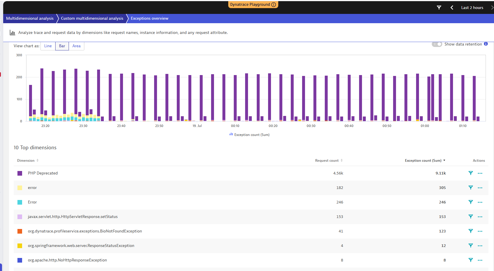

### Drill-down vers Distributed Traces

Clic sur le **nom de la dimension** (pas l'icône filtre) → menu contextuel **Analyze** : `Distributed traces` (liste filtrée auto sur cette valeur), `Exception details`, suggestion `Split by services`.

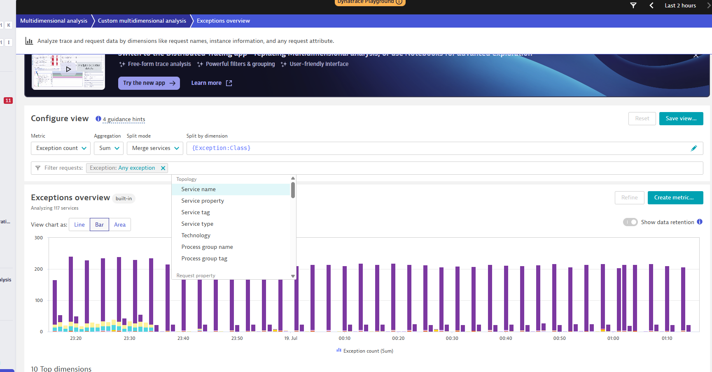

**Pattern à retenir** : `MDA (agrégats, priorisation) → Distributed Tracing (trace individuelle, root cause)`. MDA répond à « quel est le problème le plus fréquent/impactant ? », Distributed Tracing répond à « pourquoi cette requête précise a échoué ? ».

## 11.3 RUM / Frontend

### Liste des applications

`Apps → Frontend`. Colonnes clés : Name, Application type, Performance → Apdex.

⚠️ Un Apdex global « Excellent » peut coexister avec une alerte type « Too many slow user actions » : l'Apdex est une moyenne agrégée qui peut masquer un sous-ensemble d'actions très lentes minoritaires en volume.

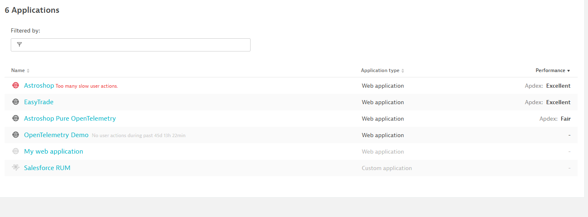

### Overview d'une application

- **Performance analysis** : Load actions (durée + Apdex rating), XHR actions (durée + erreurs), Resources (interne/3rd party)
- **User behavior** : sessions actives, actions/session, entry/exit, bounce rate, conversion goals
- **Problems (Davis AI)** : liste des problems actifs — lien direct avec le regroupement d'événements Davis (voir chapitre 2 / Alerting)

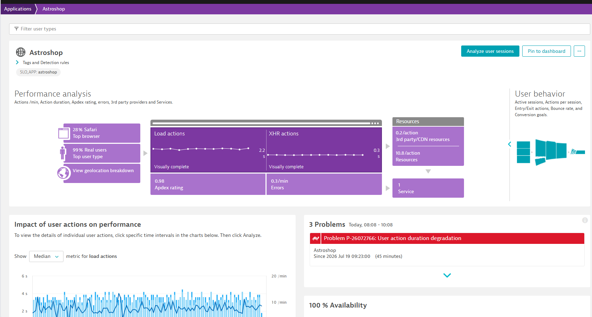

### Détail d'un Problem RUM (Davis AI)

Sections clés observées :

1. **Business impact analysis** : observed users, affected service calls, affected sessions (+ lien Replay sessions)
2. **Root cause** : soit *raised because of user configuration* (seuil/règle manuelle, proche d'un Metric event statique), soit détection automatique par **baseline** apprise dynamiquement
3. **Détail de dégradation** : ex. *current response time (390 ms) exceeds the auto-detected baseline (219 ms) by 78.08%*, type d'action concernée (Load/Xhr/Custom), volume impacté, filtres Browser/Geolocation/OS

Ces deux mécanismes (seuil manuel vs baseline dynamique) cohabitent dans Dynatrace ; savoir lequel s'applique à un Problem donné est testé à l'examen.

### Session Replay

Accès : lien « Replay sessions » depuis un Problem RUM, ou recherche → **Session Replay Classic** → app **User sessions** (filtre `Session replay: Yes` souvent actif par défaut).

Dans le détail d'une session, deux onglets :

- **Timeline** : vue chronologique agrégée des XHR/Load actions + tableau **Events and actions** (mini-PurePath frontend, chaque ligne avec sa propre Duration et son propre Apdex rating)
- **Session Replay** : reconstruction visuelle pixel-perfect du DOM + curseur souris + interactions, synchronisée avec le tableau d'événements

⚠️ RGPD/confidentialité : Session Replay peut capturer des données sensibles saisies par l'utilisateur → règles de **masquage de champs (data masking)** configurables par application. Point classique d'examen.

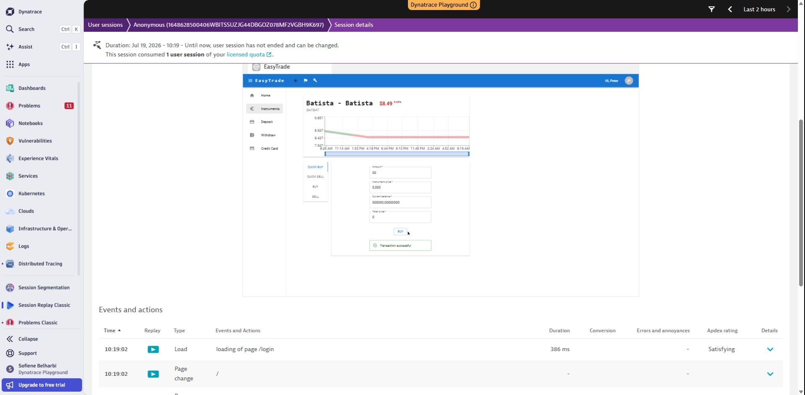

## 11.4 Annexe — Rappels de filtres Distributed Tracing

| Action | Comment faire |
|---|---|
| Filtrer par durée | Barre de filtre : `Duration > 500ms` ou facet gauche Min/Max |
| Filtrer par statut | Facet `Request status` → Success / Failure |
| Découvrir les vraies valeurs de service | Facet `Service` → autocomplete (ne jamais deviner le nom) |
| Basculer Requests ↔ Spans | Bouton « Change to spans » si aucune requête complète trouvée |
| Grouper par service | Bouton `Group by:` → Service |
